# Vertex Flow

<p align="center">
  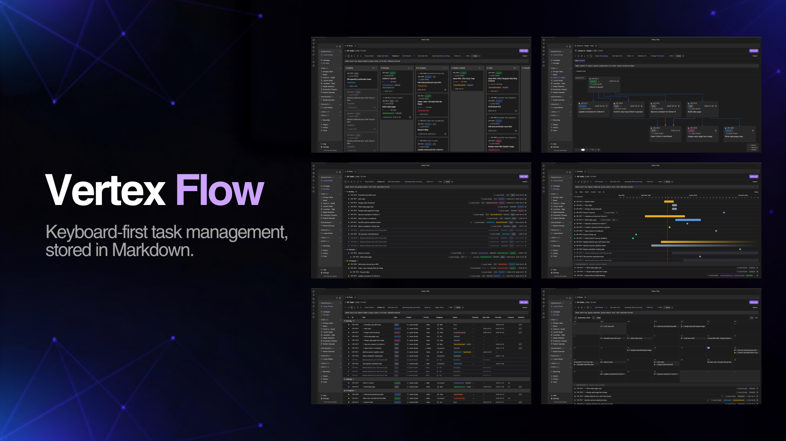
</p>

A keyboard-first task manager stored entirely as Markdown: projects, tasks, recurring schedules, six task layouts (list, board, table, timeline, calendar, canvas), chart dashboards, saved views, activity history, and an offline help system.

Vertex Flow turns your vault into a fast, high-density project management OS — no cloud, no account, no database. Every task, project, view, and dashboard is a plain Markdown note. You own the data, always, and you can edit it with any tool that reads Markdown.

## Table of Contents

- [Why Vertex Flow?](#why-vertex-flow)
- [Features](#features)
- [Layouts](#layouts)
- [Dashboards](#dashboards)
- [The Details](#the-details)
- [Getting started](#getting-started)
- [Requirements](#requirements)
- [Documentation](#documentation)
- [Support](#support)
- [Development](#development)
- [License](#license)

## Why Vertex Flow?

- **Your data is your data.** Everything lives as Markdown notes in your vault. Nothing is stored outside it, nothing is locked away in a proprietary database, and nothing requires a server. Export, sync, or back it up with whatever you already use.
- **Fast and keyboard-first.** Move between tasks, reorder cards, set statuses, and fire off quick captures without reaching for the mouse. Core actions (open, quick capture, rebuild index) are also registered as native Obsidian commands, so you can rebind them through Obsidian's own hotkey settings. Vim-flavored `j`/`k`/`h`/`l` navigation across list rows and board columns, and set any task field with the `u <key>` chord (`u s` status, `u p` priority, `u l` labels, `u a` assignee, `u r` parent, `u m` project, `u e` estimate, `u b`/`u d` start/due date, `u x` archive…). The chord applies to your whole selection at once, and `u l` can create-and-attach a fresh label as you type.
- **Full offline help.** Press `?` anywhere for the keyboard-reference, and a complete built-in Help system ships with the plugin — no internet connection or external site required.
- **Flexible by default.** Use it as a solo shopping list or run a full team. Projects and formal ceremony are optional, and every default is overridable per workspace.

## Support

If Vertex Flow helps you stay organized, consider [sponsoring on GitHub ❤️](https://github.com/sponsors/allanleonardjr) — it keeps the project moving and is much appreciated.

## Features

- **Workspace → Project → Task hierarchy.** Workspaces are independent containers with their own statuses, priorities, task types, labels, and people. Projects are optional; a task can attach to nothing, a project, or a parent task.
- **Projects are first-class too.** Each project has its own tabbed editor — editable title, icon, owner, dates, status, priority, labels, and archived — plus a live scope breakdown (tasks / sub-tasks / archived) and a computed progress bar independent of its status.
- **Six layouts, one dataset.** List, Board (Kanban), Table, Timeline/Gantt, Calendar, and Canvas (a dependency/hierarchy graph of your tasks) — switch anytime without losing your place, all drag-and-drop on desktop **and** mobile touch.
- **Chart dashboards.** A configurable grid of bar, line, pie, timeline, and KPI widgets with a dashboard-wide filter.
- **Saved Views with a query language.** Bundle layout, grouping, sort, filters, column state, and field visibility under one name. Filter through a visual chip bar or its text equivalent — a full query grammar with field aliases, `is:open` / `is:unscheduled` / `show:archived` flags, sub-task nesting and empty-column modes, and "did you mean" suggestions (e.g. `assignee:me sort:due`, `label:bug group:status`).
- **Sub-tasks with progress rollup.** Parent tasks show a progress bar from their sub-tasks — but nothing auto-completes; you stay in control.
- **Instant-write editing.** Fields save as you type — there's no Save button. Plain-text descriptions autosave on a short debounce, so nothing is ever lost to a forgotten click.
- **Comments and @mentions**, a People register, and a quick capture command that works from anywhere.
- **Real Markdown descriptions.** Task, project, and view descriptions render through Obsidian's own Markdown pipeline, so `[[wikilinks]]`, `![[embeds]]`, `#tags`, checkboxes, and callouts work just like in a regular note. Editing uses an embedded Obsidian editor with Live Preview (falling back to a textarea plus rendered preview if that internal API is unavailable).
- **Non-destructive by default.** Deleting sends items to Vertex Flow's own Trash (a reversible soft-delete) rather than forcing an immediate permanent deletion — no more panicking over a misplaced `Delete`. Restore is one action, and permanent deletion is a deliberate, separate step.
- **Task templates, bulk actions, and archival.** Reuse common setups, act on many tasks at once, and park finished work with archiving — including an opt-in auto-archive that files tasks after N days of inactivity. All with a unified deletion cascade, all stored as plain notes you can read and edit directly.
- **One taxonomy engine, four ways.** Status, Priority, Task Type, and Labels are all driven by a single engine with a consistent guard: you can't delete a value still in use until it's reassigned, recolored, or reordered.
- **Fully native to Obsidian.** Edit a task's note by hand and the views stay in sync; re-parent with a one-field frontmatter edit, never a file move.
- **Multiple workspaces at once.** Open tabs from several workspaces side by side. Each tab is tinted with its workspace's color — visible only while tabs from more than one workspace are open — so you can tell them apart at a glance.
- **Keyboard-first tab management.** Hold `Option` (macOS) or `Alt` (Windows/Linux) and press `Tab` to cycle through open tabs with an Arc-style switcher overlay (`Shift+Tab` walks back, `Esc` cancels); jump straight to any tab with `Option`/`Alt` + `1–9` (or `0` for the last) and close the active tab with `Option`/`Alt` + `W` (`Shift` closes the others). Right-click any tab for close-other, close-to-the-right, close-to-the-left, and close-all.
- **A density scale that fits your screen.** Choose compact, cozy, or comfortable UI spacing across the whole plugin — app-like density without giving up readability.
- **Fast to open, painless to keep in sync.** The index reads from Obsidian's metadata cache (no slow disk scans) and resolves @mentions in a lazy background pass, so views paint immediately and edits sync automatically.
- **Recurring Tasks:** Automate routines with recurring schedules directly in task frontmatter that automatically instantiate the next instance — on a date cadence, or when the task reaches a status. Status-triggered repeats can set the next occurrence's Start and Due dates independently: leave them blank, land them on the spawn day, or shift them to preserve the original task's date range.
- **Activity History Log:** Track past completed work, status updates, and workspace activity logs preserved in plain Markdown files.
- **Export your tasks.** Export the current view, a saved view, a project, or the whole workspace to **CSV, JSON, or iCalendar** — choose which fields to include, bring archived tasks along or not, and land a real file under `<workspace>/Exports/`. Exports are reachable from the sidebar, a Command Palette command, the view toolbar, and right-click menus on workspaces, views, and projects.
- **Reuse a workspace as a template.** **"Export Workspace as Template"** captures a workspace's statuses, priorities, task types, labels, people, saved views, and dashboards as a portable Markdown file — no tasks or projects. You pick the destination folder (type a name or browse; vault-root `Templates/` is the default), and templates saved under `Templates/` appear in the **New Workspace gallery** under "From your Vault", so you can spin up a fresh workspace already configured the way you like.


## Layouts

Work from the same Markdown-backed tasks in whichever layout fits the moment — switch anytime, nothing is lost.

### List

Scan, group, filter, and manage work in a dense list.

<p align="center">
  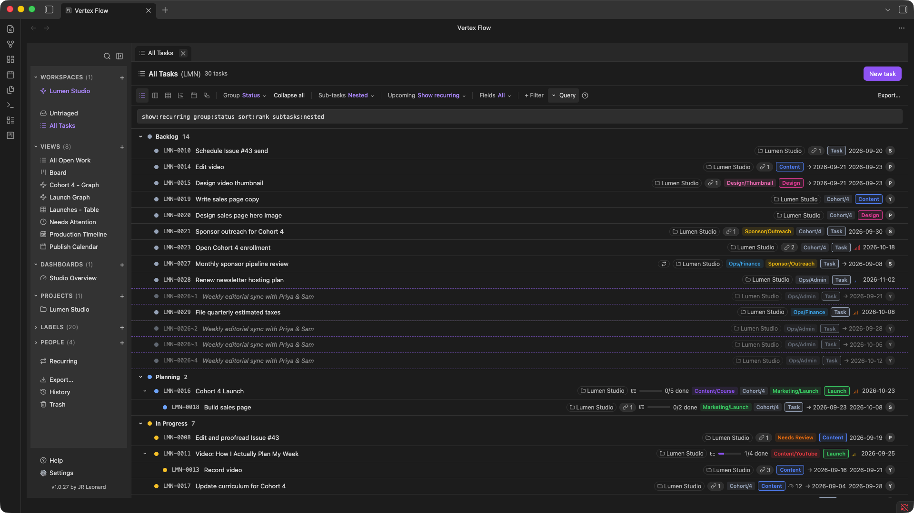
</p>

### Board

Move work through your workflow with a status-based Kanban board.

<p align="center">
  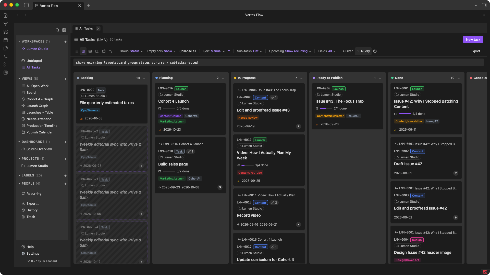
</p>

### Table

See every field at once in a dense, spreadsheet-style grid, with nested sub-tasks.

<p align="center">
  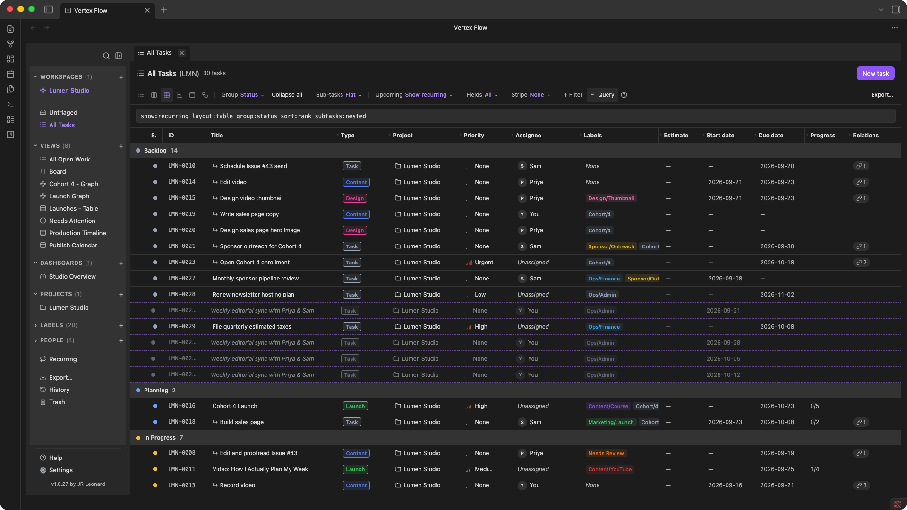
</p>

### Timeline

Plan scheduled work across time with a drag-and-drop timeline.

<p align="center">
  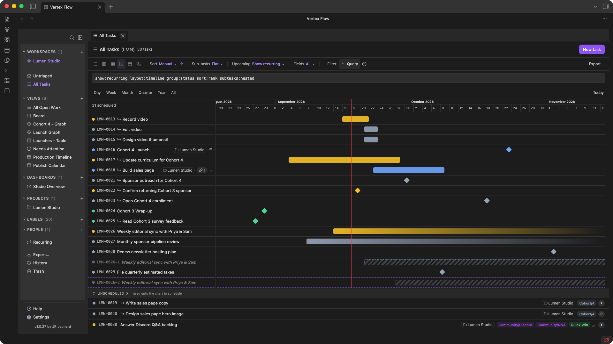
</p>

### Calendar

See dated work on a calendar.

<p align="center">
  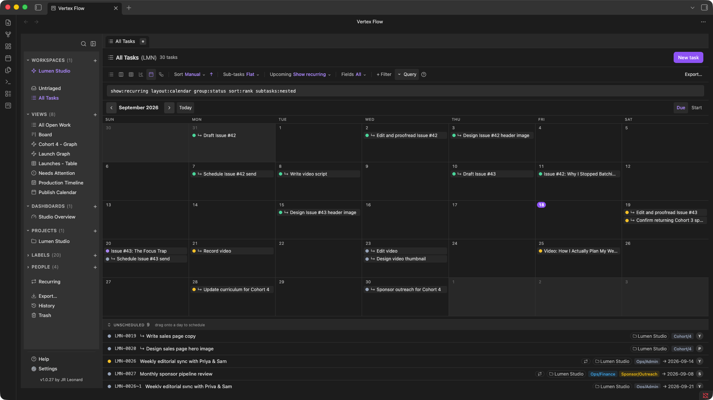
</p>

### Canvas

Visualize how work actually connects — hierarchy, dependencies, and related tasks — as a graph.

<p align="center">
  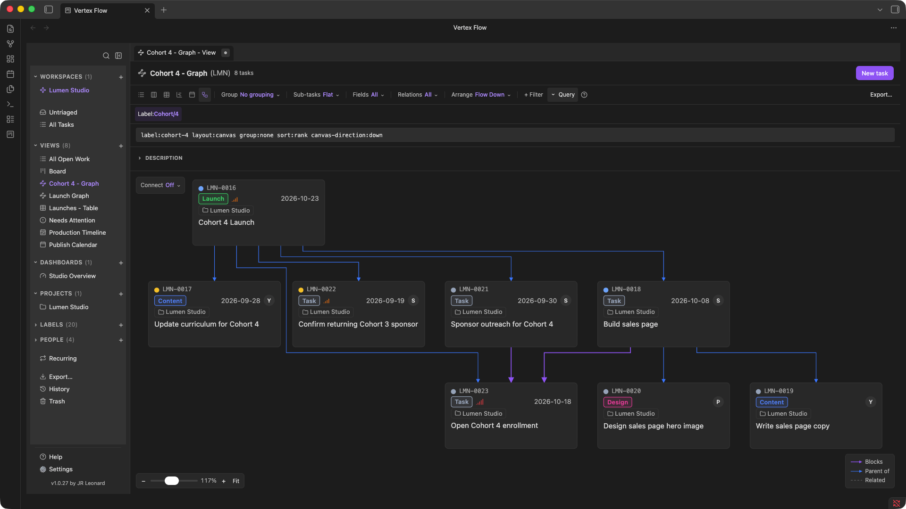
</p>

## Dashboards

A configurable grid of bar, line, pie, and KPI widgets, with a dashboard-wide filter — a live view over your Markdown, not a copy of it.

<p align="center">
  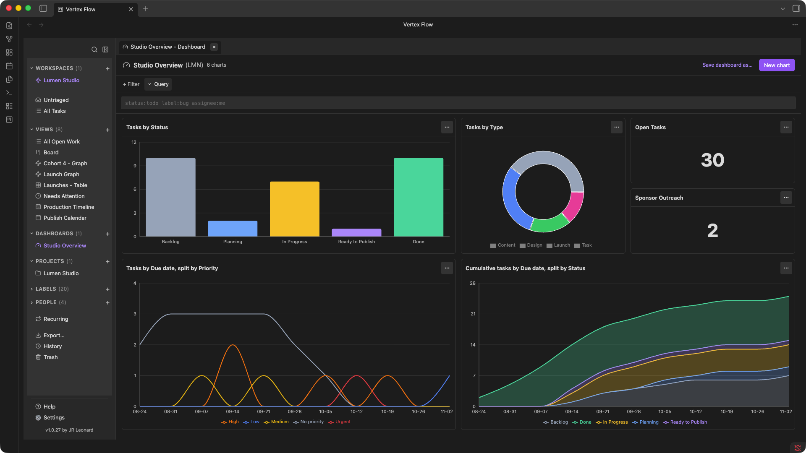
</p>

## The Details

<table>
<tr>
<td width="33%" valign="top">
  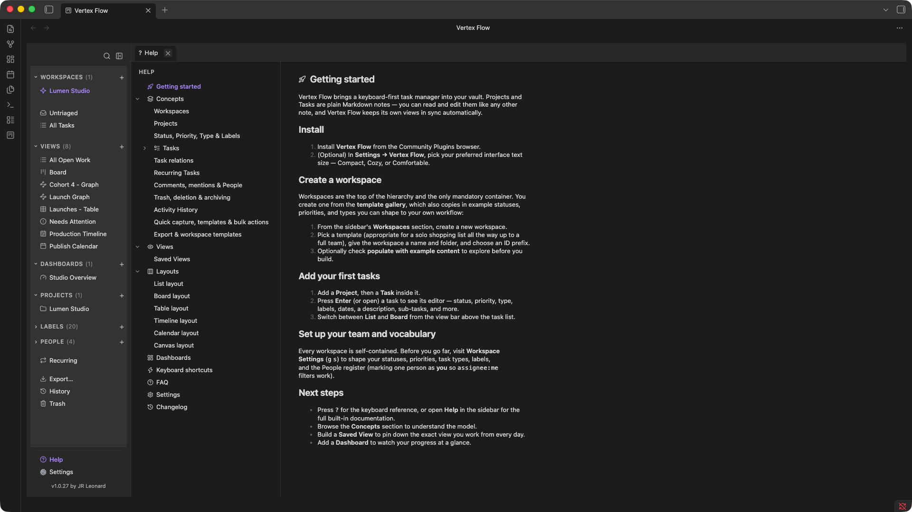<br />
  <sub><b>Help</b> — a full offline help system built into the plugin, no internet connection required.</sub>
</td>
<td width="33%" valign="top">
  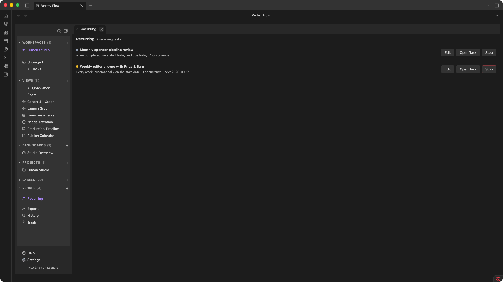<br />
  <sub><b>Recurring</b> — every repeating task across the workspace, in one place.</sub>
</td>
<td width="33%" valign="top">
  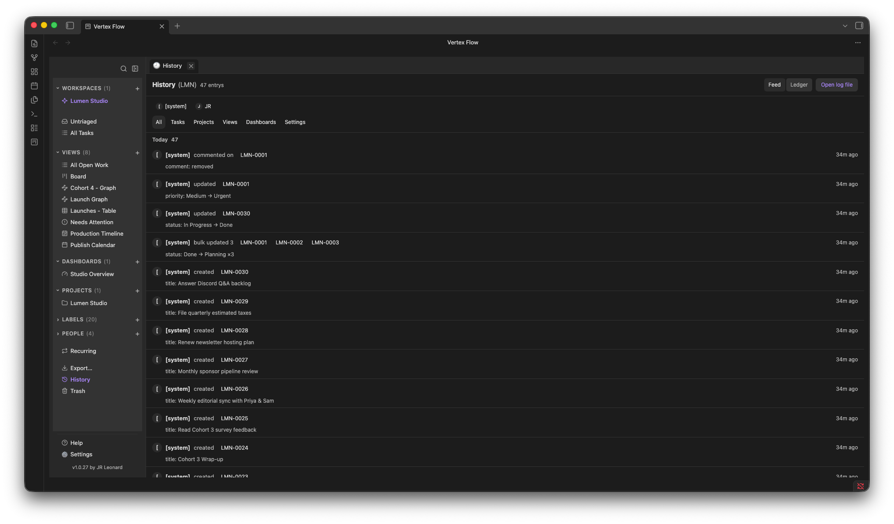<br />
  <sub><b>History</b> — a plain-Markdown log of completed work and status changes.</sub>
</td>
</tr>
<tr>
<td width="33%" valign="top">
  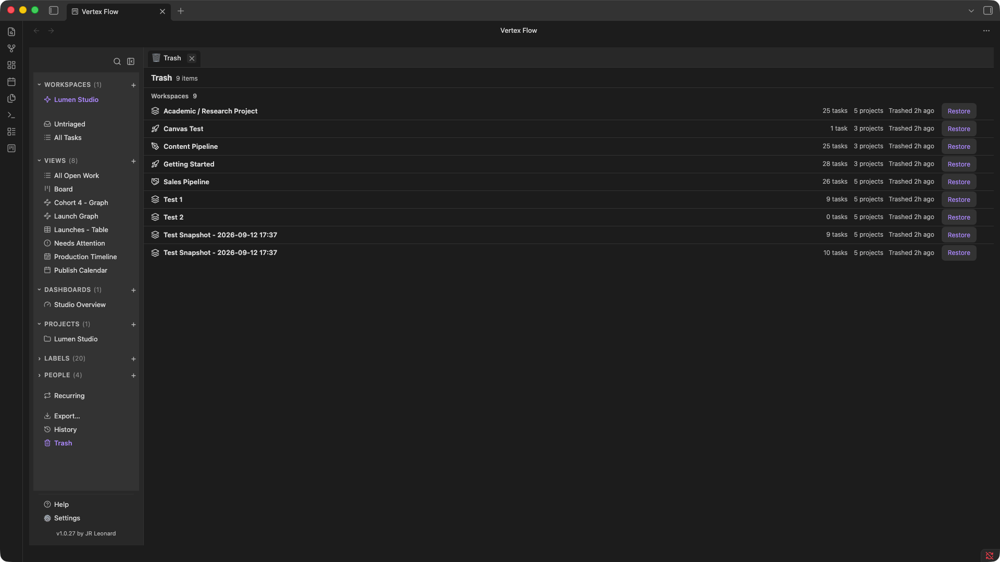<br />
  <sub><b>Trash</b> — soft-deleted by default. Restore is one action; permanent deletion is a deliberate second step.</sub>
</td>
<td width="33%" valign="top">
  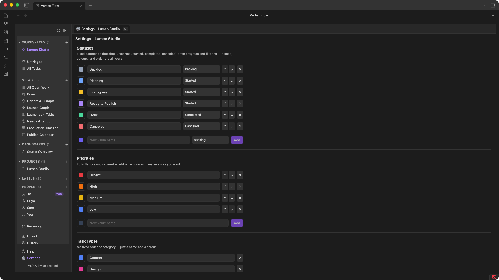<br />
  <sub><b>Settings</b> — density, defaults, and behavior, all per-vault.</sub>
</td>
<td width="33%" valign="top">
  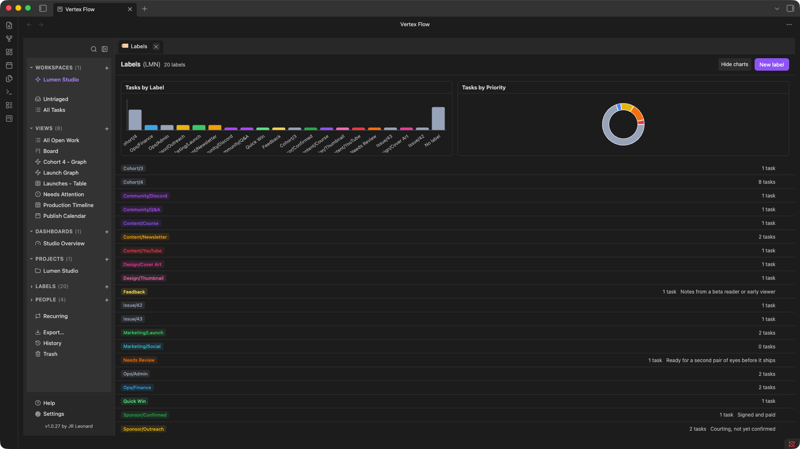<br />
  <sub><b>Labels</b> — one taxonomy engine behind Status, Priority, Type, and Labels.</sub>
</td>
</tr>
</table>

## Getting started

1. Install **Vertex Flow** from the Community Plugins browser.
2. Create a workspace from the sidebar's **Workspaces** section, or open a bundled sample workspace from the onboarding template gallery to look around. Templates you've exported from an existing workspace (via **"Export Workspace as Template…"**) appear in the same gallery under **From your Vault**.
3. Add a Project, then a Task inside it.
4. Switch between **List** and **Board** from the view bar.

> Tip: Press `?` inside Vertex Flow for the keyboard-reference, or open **Help** in the sidebar for the full built-in documentation.

## Requirements

- Obsidian `1.4.0` or later
- Works on **desktop and mobile**

## Documentation

Vertex Flow ships with a complete built-in help system available **offline in the app** — press `?` anywhere for the keyboard reference, or open **Help** in the sidebar. The source of those docs lives in this repo, so they're also readable here:

- [Getting started](src/help-content/getting-started.md)
- **Concepts** — [Workspaces](src/help-content/concepts/workspaces.md), [Projects](src/help-content/concepts/projects.md), [Tasks](src/help-content/concepts/tasks/_category.md), [Sub-tasks](src/help-content/concepts/tasks/subtasks.md), [Status, Priority, Type & Labels](src/help-content/concepts/taxonomy.md), [Task relations](src/help-content/concepts/relations.md), [Comments, mentions & People](src/help-content/concepts/comments-and-mentions.md), [Recurring Tasks](src/help-content/concepts/recurring-tasks.md), [Quick capture, templates & bulk actions](src/help-content/concepts/quick-capture-and-templates.md), [Activity History](src/help-content/concepts/activity-history.md), [Export & workspace templates](src/help-content/concepts/export-and-templates.md)
- **Layouts** — [List](src/help-content/layouts/list-layout.md), [Board](src/help-content/layouts/board-layout.md), [Table](src/help-content/layouts/table-layout.md), [Timeline](src/help-content/layouts/timeline-layout.md), [Calendar](src/help-content/layouts/calendar-layout.md), [Canvas](src/help-content/layouts/canvas-layout.md)
- **Views** — [Saved Views](src/help-content/views/saved-views.md)
- [Dashboards](src/help-content/dashboards.md)
- [Settings](src/help-content/settings.md)
- [Keyboard shortcuts](src/help-content/keyboard-shortcuts.md)
- [FAQ](src/help-content/faq.md)

Because the same Markdown files power both the in-app help and this documentation section, the two never drift out of sync.

## Development

```bash
pnpm install
pnpm dev        # build help + esbuild watch mode
pnpm build      # build help + templates → typecheck → esbuild production
pnpm typecheck  # typecheck only
pnpm test       # run the unit test suite
```

The `src/core/` domain layer is pure TypeScript with no Obsidian API imports, which keeps it fast to unit-test. Everything in `src/core/` except the `yaml` dependency is dependency-free (enforced by an architecture test).

## License

Copyright 2026 JR Leonard.

Vertex Flow is licensed under the [Apache License 2.0](./LICENSE).
